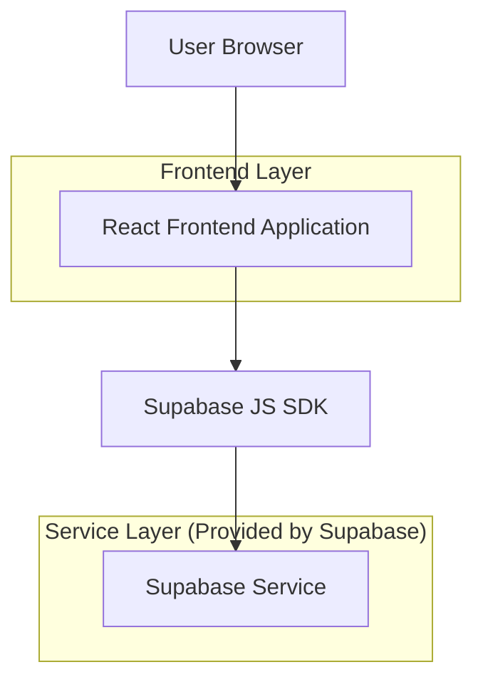
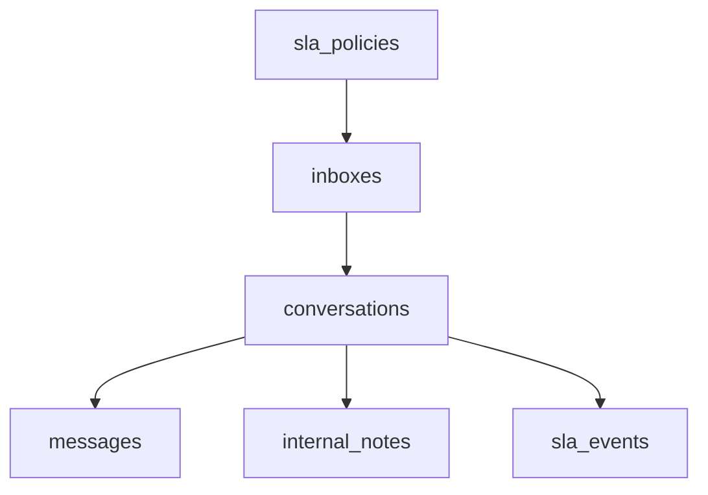

## 1.Architecture design


## 2.Technology Description
- Frontend: React@18 + TypeScript + tailwindcss@3 + vite
- Backend: Supabase (Auth + Postgres + Realtime)

## 3.Route definitions
| Route | Purpose |
|-------|---------|
| /login | Autenticación de agentes/supervisores |
| /inbox | Bandeja omnicanal (3 paneles); estado UI persistente |
| /inbox/:conversationId | Misma bandeja con conversación seleccionada (deep link) |

## 6.Data model(if applicable)

### 6.1 Data model definition
**Entidades mínimas (IDs UUID):**
- `inboxes`: colas/buzones, nombre, horario/zonas (opcional), `sla_policy_id`.
- `conversations`: `inbox_id`, canal, `external_thread_id`, estado (open/pending/closed), prioridad, `assigned_user_id`, `last_message_at`.
- `messages`: `conversation_id`, dirección (in/out), cuerpo, adjuntos (opcional), timestamps, `external_message_id`.
- `internal_notes`: `conversation_id`, body, author_user_id, timestamps.
- `sla_policies`: nombre, `first_response_target_minutes`, `next_response_target_minutes`, `resolution_target_minutes`.
- `sla_events`: `conversation_id`, tipo (first_response/next_response/resolution), `due_at`, `breached_at` (nullable), `met_at` (nullable).



**Permisos y seguridad (Supabase):**
- Auth obligatorio para operar la bandeja; RLS por defecto.
- Políticas: agentes solo ven `conversations` de `inboxes` permitidos; supervisores ven todo.

### 6.2 Data Definition Language
```sql
-- inboxes
CREATE TABLE inboxes (
  id uuid PRIMARY KEY DEFAULT gen_random_uuid(),
  name text NOT NULL,
  sla_policy_id uuid NULL,
  created_at timestamptz NOT NULL DEFAULT now()
);

-- conversations
CREATE TABLE conversations (
  id uuid PRIMARY KEY DEFAULT gen_random_uuid(),
  inbox_id uuid NOT NULL,
  channel text NOT NULL, -- whatsapp/email/ig/etc.
  external_thread_id text NULL,
  status text NOT NULL DEFAULT 'open',
  priority int NOT NULL DEFAULT 0,
  assigned_user_id uuid NULL,
  last_message_at timestamptz NULL,
  created_at timestamptz NOT NULL DEFAULT now(),
  updated_at timestamptz NOT NULL DEFAULT now()
);
CREATE INDEX idx_conversations_inbox_status ON conversations (inbox_id, status);
CREATE INDEX idx_conversations_sla_sort ON conversations (last_message_at DESC);

-- messages
CREATE TABLE messages (
  id uuid PRIMARY KEY DEFAULT gen_random_uuid(),
  conversation_id uuid NOT NULL,
  direction text NOT NULL, -- in/out
  body text NOT NULL,
  external_message_id text NULL,
  created_at timestamptz NOT NULL DEFAULT now()
);
CREATE INDEX idx_messages_conversation_created ON messages (conversation_id, created_at);

-- internal_notes
CREATE TABLE internal_notes (
  id uuid PRIMARY KEY DEFAULT gen_random_uuid(),
  conversation_id uuid NOT NULL,
  author_user_id uuid NOT NULL,
  body text NOT NULL,
  created_at timestamptz NOT NULL DEFAULT now()
);
CREATE INDEX idx_notes_conversation_created ON internal_notes (conversation_id, created_at);

-- sla_policies
CREATE TABLE sla_policies (
  id uuid PRIMARY KEY DEFAULT gen_random_uuid(),
  name text NOT NULL,
  first_response_target_minutes int NOT NULL,
  next_response_target_minutes int NOT NULL,
  resolution_target_minutes int NOT NULL,
  created_at timestamptz NOT NULL DEFAULT now()
);

-- sla_events
CREATE TABLE sla_events (
  id uuid PRIMARY KEY DEFAULT gen_random_uuid(),
  conversation_id uuid NOT NULL,
  type text NOT NULL,
  due_at timestamptz NOT NULL,
  met_at timestamptz NULL,
  breached_at timestamptz NULL,
  created_at timestamptz NOT NULL DEFAULT now()
);
CREATE INDEX idx_sla_events_due ON sla_events (due_at);

-- Grants (RLS should still control access)
GRANT SELECT ON inboxes, conversations, messages, internal_notes, sla_policies, sla_events TO anon;
GRANT ALL PRIVILEGES ON inboxes, conversations, messages, internal_notes, sla_policies, sla_events TO authenticated;
```
