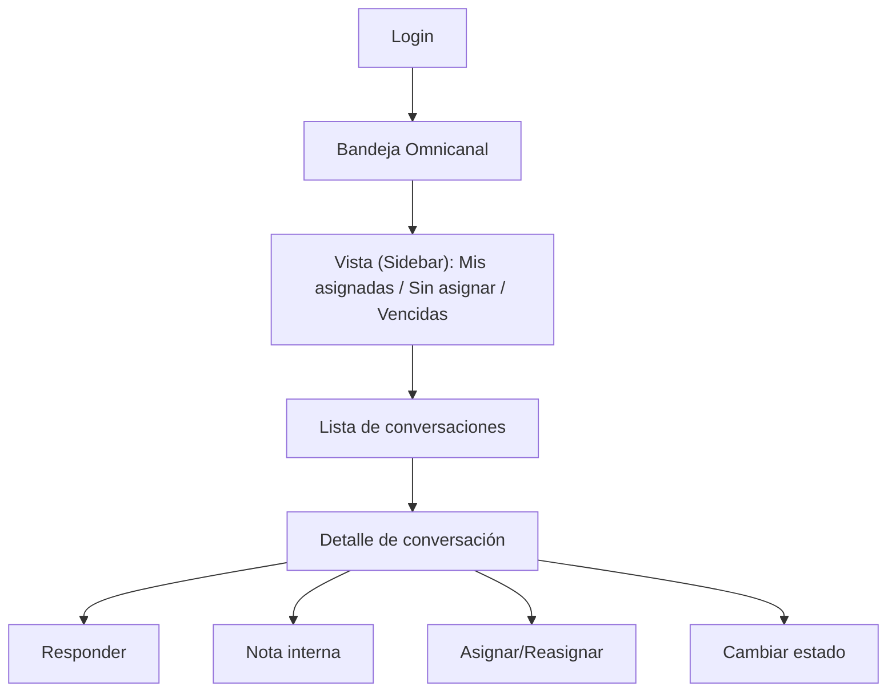

## 1. Product Overview
Rediseño de la bandeja omnicanal “tipo Slack” para gestionar conversaciones de múltiples canales en una vista de 3 paneles (sidebar + lista + detalle) siempre visibles.
Enfocado en triage rápido, colaboración mediante notas internas y control operativo con asignación y SLAs.

## 2. Core Features

### 2.1 User Roles
| Rol | Método de registro | Permisos principales |
|-----|---------------------|----------------------|
| Agente | Login corporativo | Ver colas asignadas/compartidas; responder; crear notas internas; (re)asignar si tiene permiso; cambiar estado de conversación |
| Supervisor/Administrador | Login corporativo | Gestionar políticas SLA; ver todas las colas; asignar/reasignar; auditar notas internas; monitorear incumplimientos |

### 2.2 Feature Module
1. **Login**: autenticación, recuperación de sesión, selección de organización (si aplica).
2. **Bandeja Omnicanal**: sidebar de colas/vistas, lista de conversaciones con ordenación por prioridad/SLA, detalle de conversación con timeline, respuesta, notas internas y asignación/SLA.

### 2.3 Page Details
| Page Name | Module Name | Feature description |
|-----------|-------------|---------------------|
| Login | Autenticación | Iniciar sesión y restaurar sesión activa; redirigir a la bandeja tras éxito. |
| Bandeja Omnicanal | Layout 3 paneles | Mostrar siempre: sidebar (izquierda), lista (centro), detalle (derecha); conservar selección al navegar/filtrar. |
| Bandeja Omnicanal | Sidebar (colas/vistas) | Listar colas/buzones; mostrar contadores (pendientes, sin asignar, vencidas SLA); permitir cambiar “vista” activa (p. ej. Mis asignadas / Sin asignar / Vencidas). |
| Bandeja Omnicanal | Lista de conversaciones | Listar conversaciones con: canal, último mensaje, estado (abierta/en espera/cerrada), asignado, etiquetas, indicadores SLA; ordenar y filtrar por estado/canal/asignado/SLA; búsqueda por texto. |
| Bandeja Omnicanal | Detalle: timeline | Mostrar hilo cronológico con mensajes entrantes/salientes y metadatos (canal, timestamp, autor); separar visualmente mensajes del cliente vs agente. |
| Bandeja Omnicanal | Detalle: respuesta | Redactar y enviar respuesta al canal; manejar adjuntos básicos (si el canal lo soporta); mostrar estado de envío (enviando/enviado/error). |
| Bandeja Omnicanal | Notas internas | Crear notas internas no visibles para el cliente; mostrar en timeline con estilo diferenciado; soportar @menciones internas (mínimo: seleccionar usuario) y registro de autor/hora. |
| Bandeja Omnicanal | Asignación | Ver y cambiar asignado (usuario o “Sin asignar”); registrar eventos de asignación en el timeline/actividad. |
| Bandeja Omnicanal | SLA | Mostrar contador/estado del SLA activo (p. ej. primera respuesta, siguiente respuesta, resolución); advertir cerca del vencimiento y marcar vencido; permitir que supervisor configure políticas (mínimo a nivel de cola). |

## 3. Core Process
**Flujo Agente**: Inicias sesión → eliges una vista (p. ej. “Sin asignar” o “Mis asignadas”) → seleccionas conversación → revisas timeline → (opcional) añades nota interna para contexto → respondes al cliente → actualizas estado (p. ej. “En espera”) o re-asignas si procede → monitorizas SLA desde lista/detalle.

**Flujo Supervisor**: Inicias sesión → revisas vista “Vencidas”/“Por vencer” → reasignas conversaciones para cumplir SLA → ajustas políticas SLA por cola (p. ej. tiempos objetivo) → auditas notas internas y actividad.

