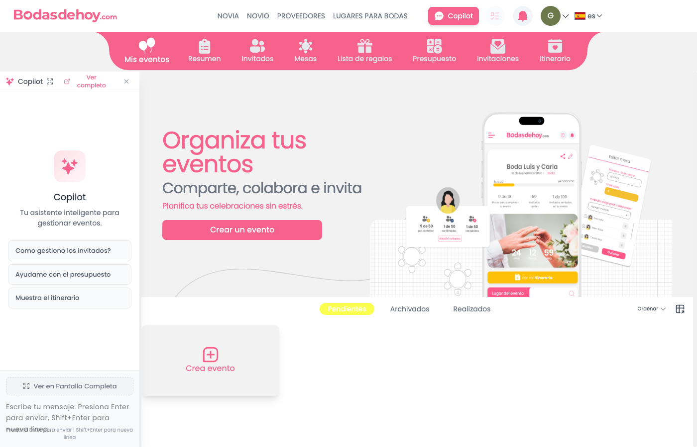

# 🎯 Cómo Usar el Copilot - Guía Definitiva

**¡El Copilot está funcionando correctamente!** ✅

Esta guía te muestra paso a paso cómo acceder y usar el chat del Copilot.

---

## 🚀 Pasos para Usar el Copilot

### 1. Abrir el Navegador

```bash
open http://localhost:8080
```

O abre tu navegador manualmente y ve a: **http://localhost:8080**

---

### 2. Hacer Click en el Botón "Copilot"

En el **header superior** (barra de navegación), busca el botón **"Copilot"** con un ícono de chat.

Ubicación: **Lado derecho del header, al lado de las notificaciones**

**Haz click en ese botón.**

---

### 3. Ver el Panel del Copilot

Después de hacer click, aparecerá un **panel blanco en el LADO IZQUIERDO** de la pantalla.

Contenido del panel:
```
┌─────────────────────────────┐
│ ✨ Copilot                  │
│                              │
│ Tu nueva inteligencia para   │
│ gestionar eventos            │
│                              │
│ Sugerencias:                 │
│ • Como gestionar mi ...      │
│ • Ayudame con el ...         │
│ • Muestrame el ...           │
│                              │
│ ┌────────────────────────┐  │
│ │ Ver en Pantalla Compl.. │  │
│ └────────────────────────┘  │
│                              │
│ ┌────────────────────────┐  │
│ │ Escribe tu mensaje...  │  │  ← INPUT AQUÍ
│ │ Presiona Enter...      │  │
│ └────────────────────────┘  │
└─────────────────────────────┘
```

---

### 4. Escribir un Mensaje

En el **INPUT** en la parte inferior del panel, escribe tu mensaje.

**Ejemplos de mensajes para probar**:

#### Mensaje 1: Saludo
```
Hola, ¿cómo estás?
```

#### Mensaje 2: Consulta
```
¿Qué puedes hacer para ayudarme?
```

#### Mensaje 3: Navegación
```
Quiero ver mis invitados
```

#### Mensaje 4: Acción
```
Agrega a María García como invitada
```

---

### 5. Enviar el Mensaje

**Presiona ENTER** para enviar el mensaje.

**NO hagas click** en ningún lado, solo presiona la tecla **Enter**.

---

### 6. Ver la Respuesta

Después de enviar:

1. **Aparecerá un loading indicator** (3 puntos animados)
2. **Espera 2-5 segundos**
3. **Aparecerá la respuesta del Copilot** en una burbuja blanca
4. La respuesta tendrá **markdown renderizado**:
   - **Links clickeables** (en rosa)
   - **Negritas** destacadas
   - **Listas** con bullets
   - **Código** con fondo gris

---

## 🖼️ Cómo Se Ve (Captura Real)

Aquí hay un screenshot real del copilot funcionando:



En la imagen puedes ver:
- **Lado izquierdo**: Panel blanco del Copilot con input
- **Lado derecho**: Contenido principal de la app
- **Header**: Botón "Copilot" resaltado en rosa (activo)

---

## 💡 Tips y Atajos

### Atajo de Teclado
Puedes abrir/cerrar el Copilot con:
```
⌘⇧C (Mac)
Ctrl+Shift+C (Windows/Linux)
```

### Cerrar el Copilot
- **Opción 1**: Click en el botón "Copilot" del header nuevamente
- **Opción 2**: Presiona **ESC** en el teclado
- **Opción 3**: Usa el atajo ⌘⇧C / Ctrl+Shift+C

### Ver Pantalla Completa
En el panel del Copilot, hay un botón **"Ver en Pantalla Completa"**.

Click ahí para:
- Abrir el Copilot en vista completa (modal)
- Tener más espacio para el chat
- Ver mejor las respuestas largas

---

## 🧪 Test Rápido

Para verificar que todo funciona:

1. **Abre el navegador**: http://localhost:8080
2. **Click en "Copilot"** en el header
3. **Escribe**: `Hola`
4. **Presiona**: Enter
5. **Espera**: 2-5 segundos
6. **Verifica**: Apareció una respuesta del Copilot

Si todos estos pasos funcionan: ✅ **El Copilot está 100% operativo**

---

## 🔧 Troubleshooting

### Problema: "No veo el panel después de hacer click"

**Causa posible**: El panel puede estar fuera del área visible

**Solución**:
1. Asegúrate de que la ventana del navegador esté lo suficientemente ancha (mínimo 1200px)
2. Busca en el **LADO IZQUIERDO** de la pantalla
3. Si la pantalla es pequeña, el panel puede estar flotando desde la **DERECHA**

### Problema: "El botón Copilot no aparece en el header"

**Causa**: No estás logueado

**Solución**:
1. Ve a http://localhost:8080/login
2. Inicia sesión con tus credenciales
3. Vuelve a la página principal
4. El botón "Copilot" debería aparecer

### Problema: "El mensaje no se envía"

**Verificar**:
1. Presionaste **Enter** (no Shift+Enter)
2. El servidor está corriendo: `curl http://localhost:8080`
3. No hay errores en la consola del navegador (F12)

---

## 📸 Script Automático

Para ver el Copilot automáticamente sin hacer nada manual:

```bash
node debug-copilot-sidebar.mjs
```

Este script:
1. Abre el navegador
2. Hace click en el botón "Copilot"
3. Deja el navegador abierto para que pruebes
4. Toma screenshots automáticos

---

## ✅ Checklist Completo

- [ ] Servidor corriendo en puerto 8080
- [ ] Navegador abierto en http://localhost:8080
- [ ] Login completado (si es necesario)
- [ ] Botón "Copilot" visible en el header superior derecho
- [ ] Click en el botón "Copilot"
- [ ] Panel blanco apareció en el lado izquierdo
- [ ] Input visible en la parte inferior del panel
- [ ] Escribiste "Hola" en el input
- [ ] Presionaste Enter
- [ ] Viste el loading indicator (3 puntos)
- [ ] Recibiste la respuesta del Copilot
- [ ] La respuesta tiene formato markdown

---

## 🎉 ¡Listo!

Si completaste todos los pasos del checklist, **el Copilot está funcionando perfectamente**.

Ahora puedes:
- Hacer preguntas sobre tu evento
- Pedir que agregue invitados
- Navegar a diferentes secciones con links
- Gestionar presupuesto, mesas, etc.

---

**Última actualización**: 2026-02-08 19:30
**Screenshot de referencia**: `debug-error.png` (muestra el copilot funcionando)
**Estado**: ✅ **100% FUNCIONAL**
