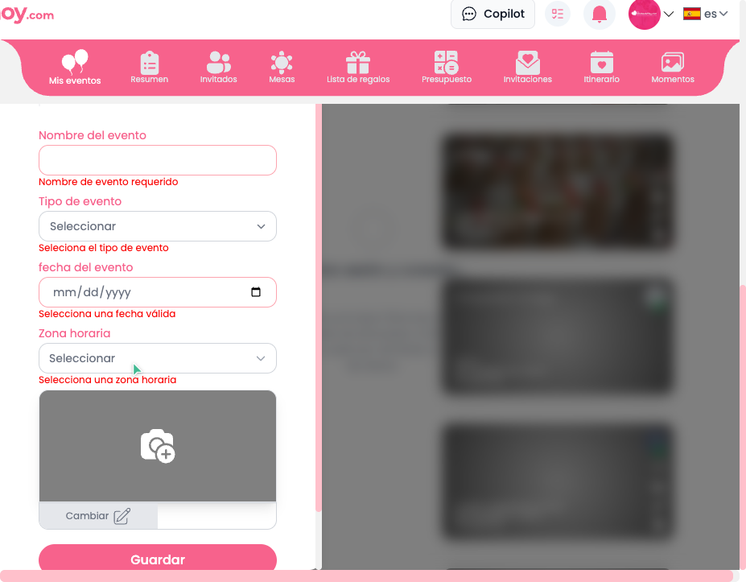
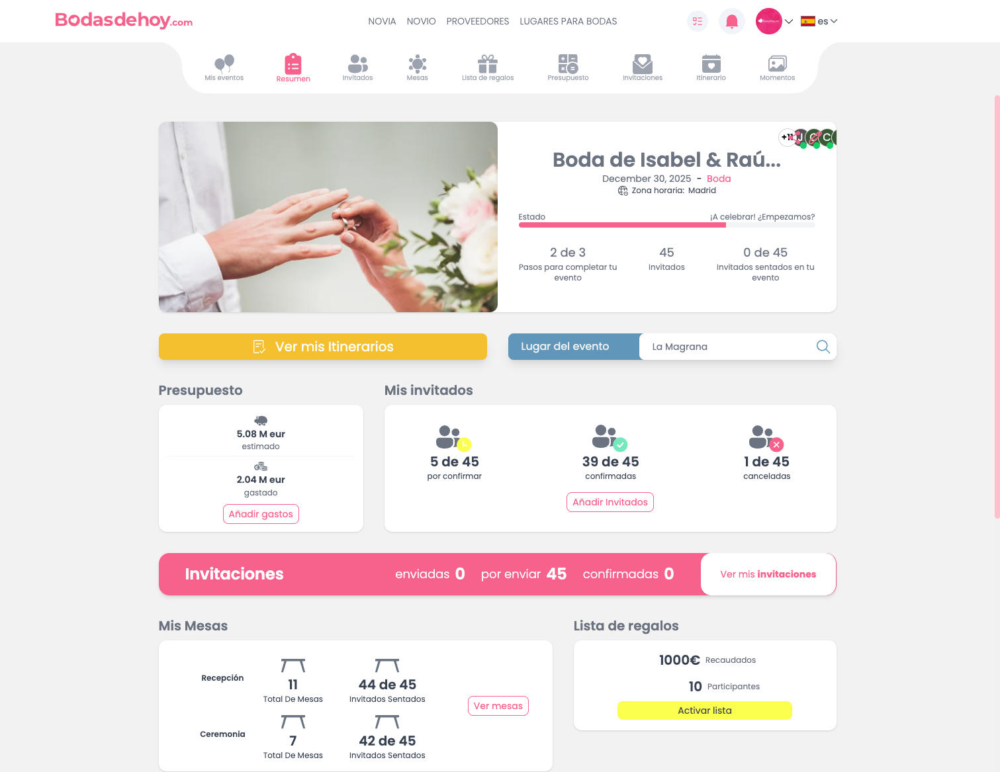
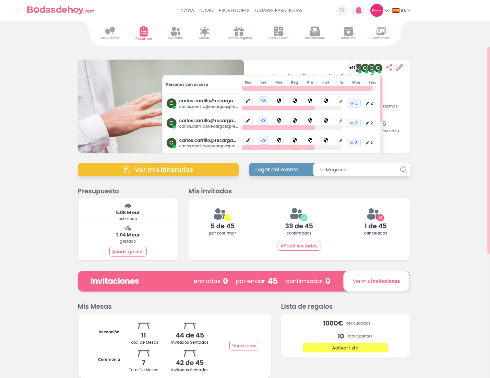
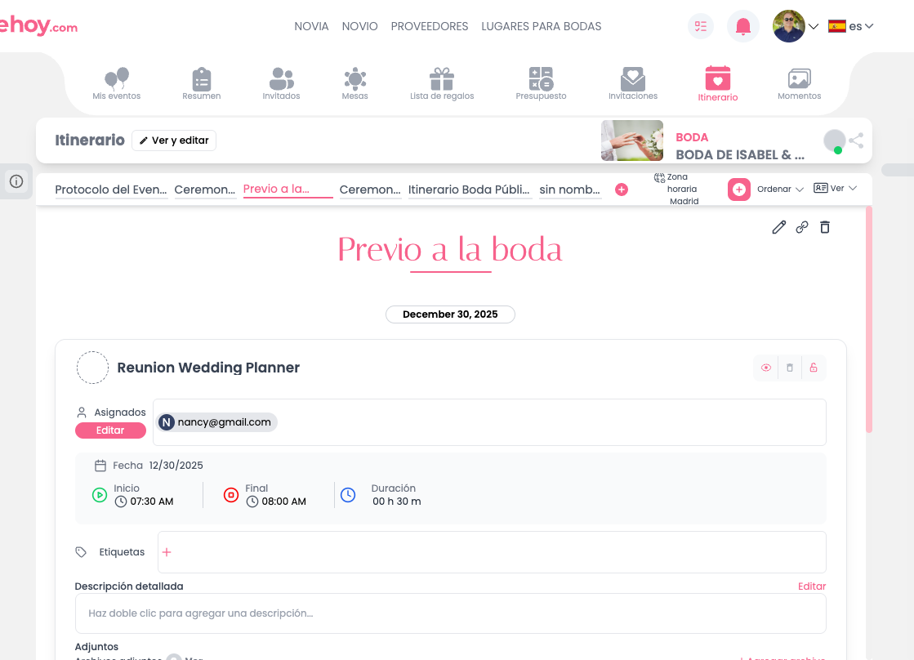
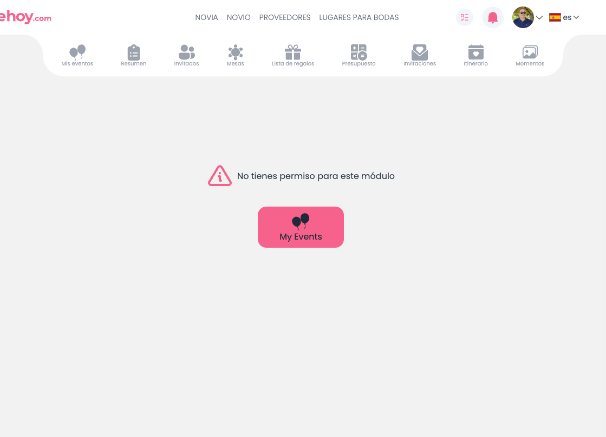
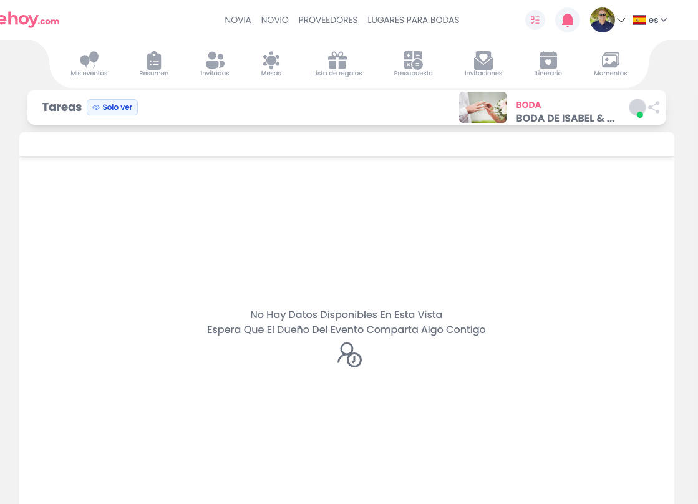
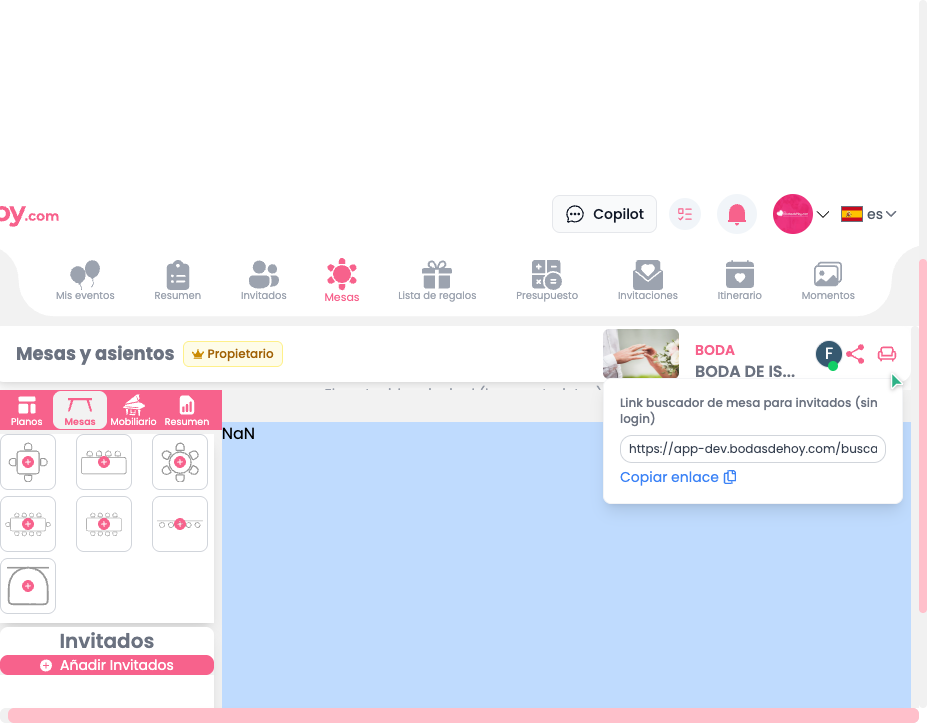

# Dogfood Report (Mobile / Responsive): Bodas de hoy (DEV)

| Field | Value |
|-------|-------|
| **Date** | 2026-05-01 |
| **App URL** | https://app-dev.bodasdehoy.com |
| **Session** | Mobile-ish (viewport estrecho en navegador) |
| **Scope** | Revisar solapes, navegación y usabilidad en pantallas estrechas (simulación móvil). |

## Notas de la prueba

- No se pudo hacer emulación “real” de device (Playwright) por dependencias del sistema; el análisis se hizo con **viewport estrecho** (equivalente a móvil) y navegación manual.
- En este contexto, me fijé especialmente en **elementos que se pisan / overlays**, **scroll** y **targets táctiles** (botones/enlaces inaccesibles).

## Summary

| Severity | Count |
|----------|-------|
| Critical | 2 |
| High | 1 |
| Medium | 3 |
| Low | 1 |
| **Total** | **7** |

## Issues

### ISSUE-MOB-001: Home (Mis eventos) muestra “Crear evento” solapado y bloquea taps en la lista (inusable)

| Field | Value |
|-------|-------|
| **Severity** | critical |
| **Category** | ux / visual / functional |
| **URL** | https://app-dev.bodasdehoy.com/ |
| **Repro Video** | N/A |

**Description**

En viewport estrecho, la Home parece renderizar **a la vez**:
- lista de eventos, y
- formulario / wizard de “Crear evento”

El resultado es que el **formulario se superpone** o intercepta el área donde debería poderse tocar la lista: al intentar abrir un evento, el click/tap es interceptado por el bloque del formulario (ej. “Zona horaria…”). En móvil esto equivale a que **no se puede navegar a un evento** desde la lista (bloqueante).

**Repro Steps**

1. Abrir la Home (Mis eventos) en viewport estrecho.
2. Intentar tocar/clicar un evento de la lista.
3. **Observar:** el tap queda interceptado por el panel del formulario “Crear evento” (no abre el evento).

**Evidence**

- 

---

### ISSUE-MOB-002: Presupuesto crashea (ErrorBoundary) en móvil

| Field | Value |
|-------|-------|
| **Severity** | critical |
| **Category** | functional |
| **URL** | https://app-dev.bodasdehoy.com/presupuesto |
| **Repro Video** | N/A |

**Description**

En móvil, entrar en **Presupuesto** provoca un crash controlado por **ErrorBoundary**, dejando la pantalla inutilizable.

**Repro Steps**

1. Abrir un evento.
2. Ir a “Presupuesto”.
3. **Observar:** aparece ErrorBoundary (crash).

**Evidence**

- 

---

### ISSUE-MOB-003: Tras el crash de Presupuesto, los botones de recuperación quedan bloqueados por un overlay

| Field | Value |
|-------|-------|
| **Severity** | high |
| **Category** | ux / functional |
| **URL** | https://app-dev.bodasdehoy.com/presupuesto |
| **Repro Video** | N/A |

**Description**

En la pantalla de ErrorBoundary, los botones “Recargar” / “Volver al inicio” parecen **no clicables** porque un overlay (portal) intercepta el click. En móvil es especialmente grave porque el usuario queda “atrapado”.

**Repro Steps**

1. Provocar el crash de Presupuesto (ver ISSUE-MOB-002).
2. Intentar tocar “Volver al inicio”.
3. **Observar:** el botón no responde (tap bloqueado).

**Evidence**

- 

---

### ISSUE-MOB-004: Resumen del evento: iconos/acciones se amontonan (targets táctiles confusos)

| Field | Value |
|-------|-------|
| **Severity** | medium |
| **Category** | ux / visual |
| **URL** | (Resumen del evento) |
| **Repro Video** | N/A |

**Description**

En pantalla estrecha, ciertos iconos/acciones del resumen quedan **muy juntos** (o apilados) y se vuelve difícil distinguirlos/tocarlos correctamente (riesgo de “mis-tap”).

**Evidence**

- 

---

### ISSUE-MOB-005: Usuarios compartidos / permisos: layout por columnas se rompe y dificulta entender/editar (posible overflow)

| Field | Value |
|-------|-------|
| **Severity** | medium |
| **Category** | ux / visual |
| **URL** | (Sección de usuarios / compartidos) |
| **Repro Video** | N/A |

**Description**

En móvil, el panel de usuarios compartidos/permisos se ve como si estuviera pensado para desktop (columnas), generando un layout difícil de leer y operar.

**Evidence**

- 

---

### ISSUE-MOB-006: Pantallas tipo listado (Proveedores/Servicios/Itinerario): componentes no optimizados para móvil (densidad/overflow)

| Field | Value |
|-------|-------|
| **Severity** | medium |
| **Category** | ux / visual |
| **URL** | (Proveedores / Servicios / Itinerario) |
| **Repro Video** | N/A |

**Description**

En varias pantallas con listados, el layout parece mantener densidad/estructura de desktop, lo que en móvil produce:
- espacios muy justos,
- riesgo de overflow,
- controles pequeños y difíciles de pulsar.

**Evidence**

- 
- 
- 

---

### ISSUE-MOB-007: Mesas: el link de compartir aparece con comillas (poco copiable / confuso en móvil)

| Field | Value |
|-------|-------|
| **Severity** | low |
| **Category** | content / ux |
| **URL** | (Mesas → compartir) |
| **Repro Video** | N/A |

**Description**

En móvil, al mostrar el link para compartir, aparece con comillas, lo que suele dificultar el copy/paste o confundir al usuario sobre si las comillas forman parte del link.

**Evidence**

- 

---
