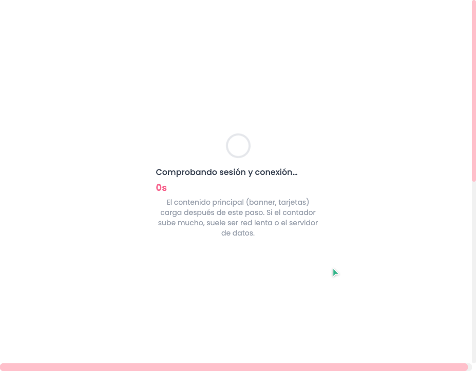
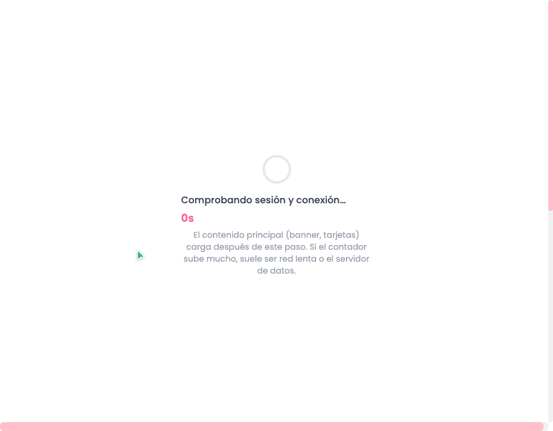
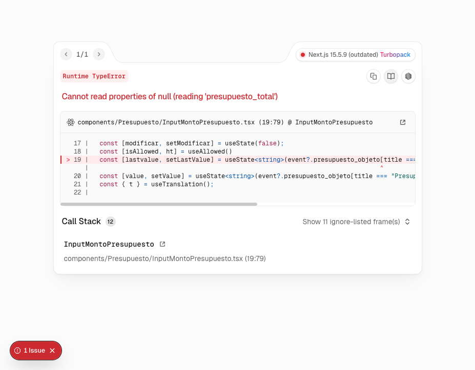
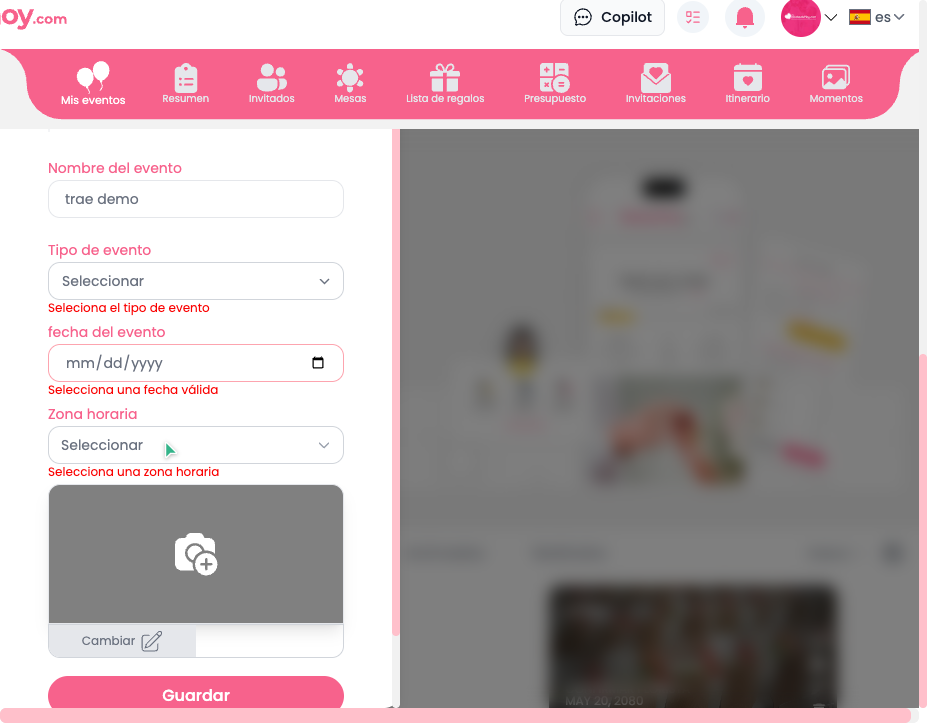
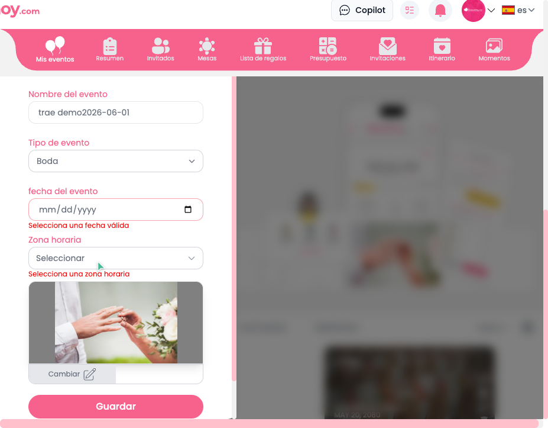

# Dogfood Report: Bodasdehoy (app-dev)

| Field | Value |
|-------|-------|
| **Date** | 2026-05-01 |
| **App URL** | https://app-dev.bodasdehoy.com |
| **Session** | dogfood-bodasdehoy-dev-2026-05-01 |
| **Scope** | Flujo “Copiar evento (UI)”: abrir “Boda de Isabel y Raúl” → intentar usar Presupuesto y Mesas para replicar hacia un evento nuevo “trae demo”. |

## Summary

| Severity | Count |
|----------|-------|
| Critical | 1 |
| High | 2 |
| Medium | 1 |
| Low | 1 |
| **Total** | **5** |

## Issues

### ISSUE-001: “Presupuesto” rompe el evento (ErrorBoundary + TypeError leyendo `presupuesto_total`)

| Field | Value |
|-------|-------|
| **Severity** | critical |
| **Category** | functional / console |
| **URL** | https://app-dev.bodasdehoy.com/presupuesto |
| **Repro Video** | N/A |

**Description**

Al entrar en **Presupuesto** desde el menú lateral de un evento (ej. “Boda de Isabel y Raúl”), la app cae en un **ErrorBoundary** (“⚠️ Error Capturado por ErrorBoundary”) y no se puede acceder a la funcionalidad de presupuesto.

En consola aparece un error reproducible:

- `TypeError: Cannot read properties of null (reading 'presupuesto_total')`
- Componente: `<InputMontoPresupuesto>`

Esto bloquea completamente el flujo de “copiar presupuesto” vía UI.

**Repro Steps**

1. Abrir el evento “Boda de Isabel y Raúl” desde **Mis eventos**
   

2. En el menú lateral, hacer click en **Presupuesto**
   

3. **Observar:** se muestra la pantalla de ErrorBoundary en `/presupuesto`
   

**Evidence (logs)**

- Consola: `browser-logs/console-2026-05-01T10-29-52-963Z.log`
- Network: `browser-logs/network-2026-05-01T10-30-00-137Z.log`

---

### ISSUE-002: Tras el crash de “Presupuesto”, el evento queda atrapado en ErrorBoundary y los botones de recuperación no funcionan (overlay)

| Field | Value |
|-------|-------|
| **Severity** | high |
| **Category** | functional / ux |
| **URL** | https://app-dev.bodasdehoy.com/resumen-evento |
| **Repro Video** | N/A |

**Description**

Después de entrar a **Presupuesto** (que crashea), al volver a **Resumen** el evento queda en la pantalla de ErrorBoundary (no vuelve al contenido del evento). Además, los botones de recuperación **“Recargar Página”** y **“Volver al inicio”** aparecen pero quedan **bloqueados por un overlay** (se interceptan los clicks).

Esto hace difícil/inesperado recuperar el flujo sin “forzar” un cambio de URL (ej. escribir `/` manualmente).

**Repro Steps**

1. Abrir el evento “Boda de Isabel y Raúl” y entrar a **Presupuesto** (ver ISSUE-001)
2. Volver atrás a **Resumen**
   
3. Intentar pulsar **“Recargar Página”** o **“Volver al inicio”**
   

---

### ISSUE-003: “Mesas” muestra textos mezclados ES/EN y el link del buscador se copia con comillas

| Field | Value |
|-------|-------|
| **Severity** | medium |
| **Category** | ux / content |
| **URL** | https://app-dev.bodasdehoy.com/mesas |
| **Repro Video** | N/A |

**Description**

En la pantalla de **Mesas** aparecen textos en inglés mezclados con español (ej. “Editar guest”). Además, al pulsar **“Compartir buscador de mesa”**, el link aparece dentro de un campo con **comillas incluidas** (`"https://..."`), lo que introduce fricción/errores al copiar y pegar (el usuario copiará comillas).

**Repro Steps**

1. Abrir un evento → menú lateral **Mesas**
   
2. Pulsar **“Compartir buscador de mesa”**
   

---

### ISSUE-004: Crear evento (“trae demo”) — formulario confuso: campos sin label, errores de texto, Escape no cierra, y el input de fecha no se puede completar correctamente

| Field | Value |
|-------|-------|
| **Severity** | high |
| **Category** | ux / accessibility / functional |
| **URL** | https://app-dev.bodasdehoy.com/ |
| **Repro Video** | N/A |

**Description**

Al intentar crear el evento **“trae demo”** desde **Crear un evento**:

- El campo de “Nombre del evento” aparece como `textbox` sin label accesible claro (en snapshot sale sin `name` contextual).
- Mensajes de validación con errores/consistencia (“Seleciona el tipo de evento”, “fecha del evento” en minúscula).
- Pulsar **Escape** no cierra el formulario/modal.
- Al intentar completar la **fecha**, la entrada termina **modificando el nombre del evento** (se concatena `2026-06-01` al nombre), lo cual sugiere que el foco o el input de fecha no funciona como se espera.

En conjunto, hace difícil crear el evento de destino (“trae demo”) para poder replicar contenido desde otro evento.

**Repro Steps**

1. En “Mis eventos”, pulsar **Crear un evento**
2. Escribir “trae demo” y revisar validaciones
   
3. Intentar introducir fecha (ej. `2026-06-01`) y observar que se concatena al nombre / no queda en su campo
   

---

### ISSUE-005: Inconsistencias de idioma en Resumen del evento (“search”, fecha en inglés, título truncado)

| Field | Value |
|-------|-------|
| **Severity** | low |
| **Category** | content / ux |
| **URL** | https://app-dev.bodasdehoy.com/resumen-evento |
| **Repro Video** | N/A |

**Description**

En el resumen del evento se observan varios elementos en inglés y/o con truncado:

- Campo con placeholder “search”.
- Fecha mostrada en inglés (“August 15, 2024”) mientras el resto de la UI está en español.
- Título del evento truncado con “…” (“Boda de Isabel y Raú...”) incluso en pantalla amplia.

**Repro Steps**

1. Abrir el evento “Boda de Isabel y Raúl”
   

---
