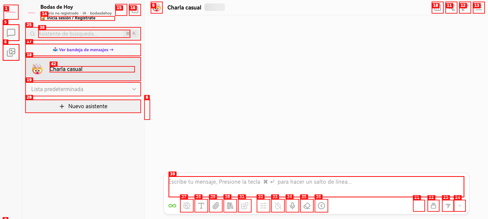
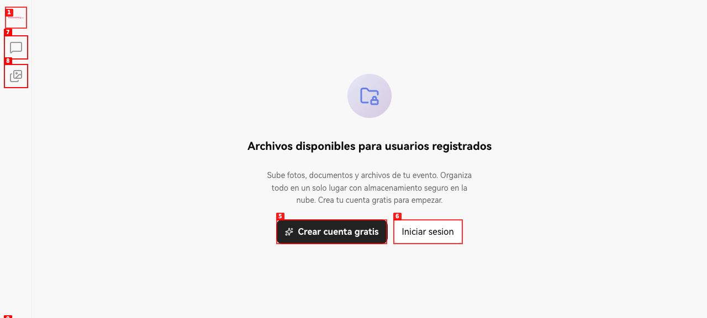
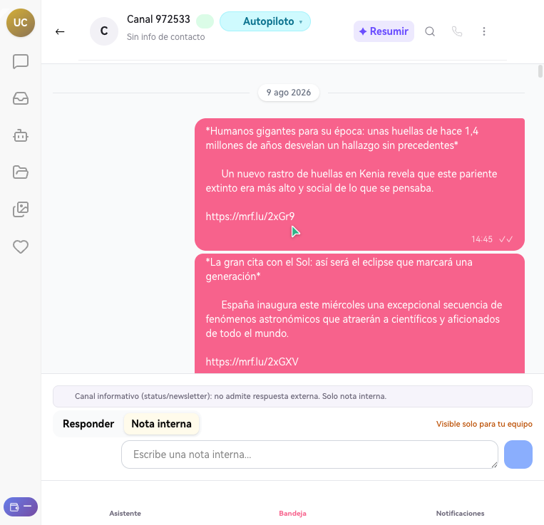
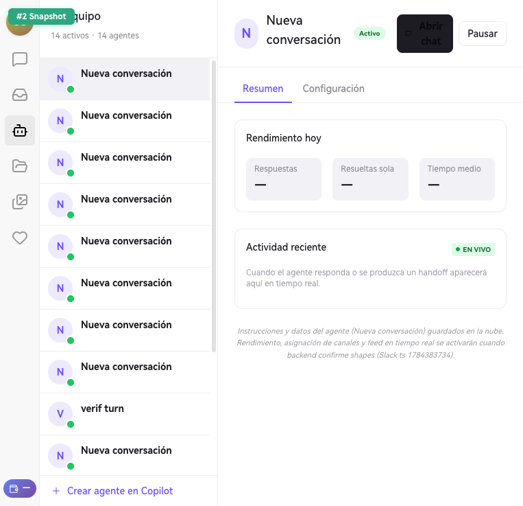
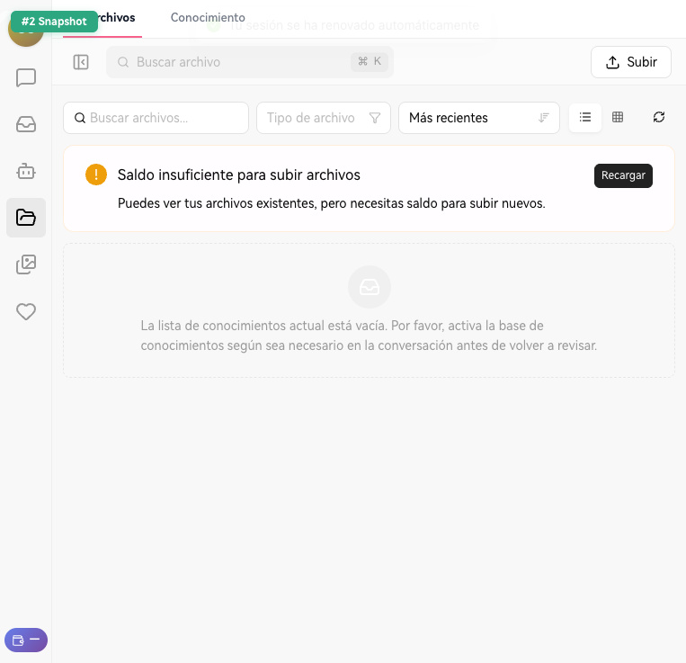
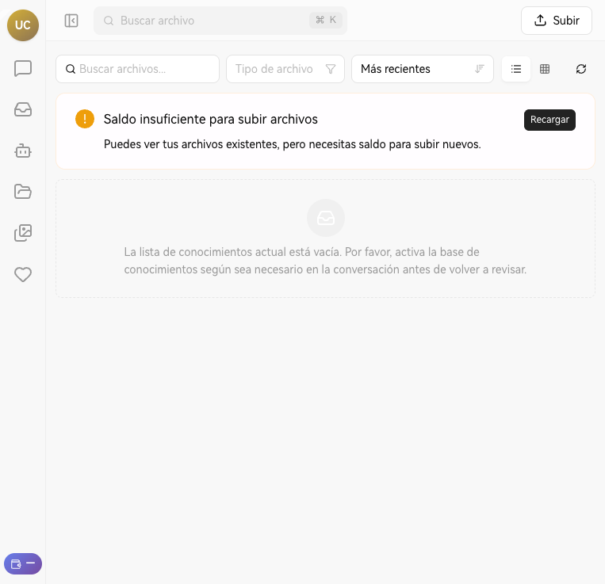

# Dogfood Report: chat-dev.bodasdehoy.com

| Field | Value |
|-------|-------|
| **Date** | 2026-08-20 |
| **App URL** | https://chat-dev.bodasdehoy.com |
| **Session** | `bdh-chat-dev-qa-20260820` + navegador integrado con sesión previa |
| **Scope** | QA exploratoria sobre `Asistente`, `Agentes`, `Bandeja`, `Biblioteca`, `Knowledge` y `bandeja?view=esperan`, comparando sesión limpia sin credenciales y sesión con acceso ya persistido |

## Summary

| Severity | Count |
|----------|-------|
| Critical | 0 |
| High | 3 |
| Medium | 3 |
| Low | 0 |
| **Total** | **6** |

## Notes

- La sesión limpia se ejecutó con `agent-browser` sin credenciales ni estado previo.
- La sesión autenticada se validó sobre una sesión ya abierta en navegador integrado, porque no había un Chrome local reusable con `--auto-connect`.
- No se introdujeron contraseñas ni se forzó login manual durante esta ronda.
- Evidencia adicional de consola: `qa/qa-chat-dev-completo-2026-08-20/console-auth.log`.

## Issues

### ISSUE-001: Deep links de producto muestran shell de login en la propia ruta, sin redirección clara

| Field | Value |
|-------|-------|
| **Severity** | high |
| **Category** | functional |
| **URL** | `https://chat-dev.bodasdehoy.com/agentes`, `https://chat-dev.bodasdehoy.com/bandeja`, `https://chat-dev.bodasdehoy.com/files` |
| **Repro Video** | N/A |

**Description**

En una sesión limpia, las rutas profundas de producto no redirigen de forma explícita a una pantalla de login dedicada ni muestran una explicación contextual del bloqueo. Mantienen la URL de producto (`/agentes`, `/bandeja`, `/files`) pero renderizan un shell genérico con `Iniciar sesión` y un rail mínimo. Esto hace muy difícil saber si la página ha fallado, si el usuario está en modo visitante o si está viendo una versión limitada.

**Repro Steps**

1. Abrir `https://chat-dev.bodasdehoy.com/asistente` con una sesión limpia.
   

2. Navegar directamente a `https://chat-dev.bodasdehoy.com/agentes`.
   

3. Navegar directamente a `https://chat-dev.bodasdehoy.com/bandeja`.
   

4. **Observe:** la URL sigue siendo de producto, pero el contenido mostrado es un shell de login minimalista y no una redirección/guard clara.
   

---

### ISSUE-002: Elementos `WA` en Bandeja abren conversaciones no respondibles y solo permiten nota interna

| Field | Value |
|-------|-------|
| **Severity** | high |
| **Category** | functional |
| **URL** | `https://chat-dev.bodasdehoy.com/bandeja/wa-6a645452a37f4070cb533ee5/conv_1786092922774_ucdgav3s6` |
| **Repro Video** | N/A |

**Description**

Desde la lista unificada de `Bandeja`, varios ítems etiquetados como `WA` parecen conversaciones operables de WhatsApp. Sin embargo, al abrir el detalle, el sistema muestra `Canal informativo (status/newsletter): no admite respuesta externa. Solo nota interna.` y desactiva `Responder`. Para un operador, esto rompe la expectativa principal de la bandeja: continuar el hilo y contestar desde el detalle.

**Repro Steps**

1. Abrir una sesión autenticada y entrar en `Bandeja`.
   

2. Seleccionar un ítem de la lista marcado como `W` / `Canal W`.
   

3. Revisar el detalle de la conversación.
   

4. **Observe:** el botón `Responder` está deshabilitado y solo queda disponible `Nota interna`, aunque el acceso comenzó desde una entrada `WA`.
   

---

### ISSUE-003: La vista de Agentes no identifica bien a los agentes; la mayoría aparecen como `Nueva conversación`

| Field | Value |
|-------|-------|
| **Severity** | high |
| **Category** | ux |
| **URL** | `https://chat-dev.bodasdehoy.com/agentes` |
| **Repro Video** | N/A |

**Description**

En `Agentes` se listan `14 activos · 14 agentes`, pero una gran parte de ellos comparten el mismo nombre visible `Nueva conversación`. En la práctica, esto impide saber cuál hizo qué, cuál corresponde a un flujo concreto o qué historial debería abrirse. Para operación diaria o QA resulta muy difícil mapear trabajo, identidad y estado.

**Repro Steps**

1. Abrir la vista autenticada de `Agentes`.
   

2. Revisar la columna izquierda `Tu equipo`.
   

3. Comparar los nombres visibles de los agentes listados.
   

4. **Observe:** muchos agentes usan el mismo nombre `Nueva conversación`, por lo que no existe una identificación operativa útil.
   

---

### ISSUE-004: La propia UI de Agentes expone que parte de la funcionalidad sigue pendiente de backend

| Field | Value |
|-------|-------|
| **Severity** | medium |
| **Category** | functional |
| **URL** | `https://chat-dev.bodasdehoy.com/agentes` |
| **Repro Video** | N/A |

**Description**

En la pestaña `Configuración`, la interfaz indica explícitamente que `Rendimiento, asignación de canales y feed en tiempo real se activarán cuando backend confirme shapes`. Esto comunica que una parte central del producto visible al usuario todavía no está soportada de extremo a extremo. El problema no es solo técnico; también es de confianza, porque la pantalla sugiere una capacidad operativa que aún no está consolidada.

**Repro Steps**

1. Abrir `Agentes` con acceso autenticado.
   

2. Entrar en la pestaña `Configuración`.
   

3. Revisar el texto de estado debajo de la configuración del agente.
   

4. **Observe:** la propia pantalla confirma que canales, rendimiento y feed en tiempo real aún dependen de shapes/backend no cerrados.
   

---

### ISSUE-005: La ruta `Knowledge` queda en shell vacío y no ofrece una experiencia utilizable

| Field | Value |
|-------|-------|
| **Severity** | medium |
| **Category** | functional |
| **URL** | `https://chat-dev.bodasdehoy.com/knowledge` |
| **Repro Video** | N/A |

**Description**

Desde `Biblioteca` existe la separación conceptual entre `Archivos` y `Conocimiento`, pero al abrir directamente `https://chat-dev.bodasdehoy.com/knowledge` la pantalla queda en un shell casi vacío, sin contenido funcional visible. Esto genera la sensación de ruta rota o incompleta.

**Repro Steps**

1. Abrir `Biblioteca` autenticada.
   

2. Identificar la navegación `📄 Archivos` / `📚 Conocimiento`.
   

3. Abrir directamente `https://chat-dev.bodasdehoy.com/knowledge`.
   

4. **Observe:** la ruta carga el shell principal, pero no presenta contenido útil de conocimiento.
   

---

### ISSUE-006: Errores y warnings persistentes de token y renderizado en consola durante la navegación autenticada

| Field | Value |
|-------|-------|
| **Severity** | medium |
| **Category** | console |
| **URL** | varias (`/asistente`, `/bandeja`, `/agentes`) |
| **Repro Video** | N/A |

**Description**

Durante la navegación autenticada aparecieron varios mensajes de consola relevantes: `JWT token expirado`, `NO SE ENCONTRÓ NINGÚN TOKEN`, `net::ERR_ABORTED` hacia `cdn-cgi/rum` y un `Minified React error #418`. Aunque no todos rompen inmediatamente la UI, sí indican inestabilidad de sesión y de renderizado, especialmente sensibles en flujos de bandeja y agentes.

**Repro Steps**

1. Abrir y navegar entre `Asistente`, `Agentes`, `Bandeja` y `Biblioteca` con una sesión ya autenticada.
   

2. Abrir el detalle de una conversación en `Bandeja`.
   

3. Revisar la salida de consola capturada durante la sesión.
   

4. **Observe:** el log contiene warnings y errores de token/ciclo de renderizado. Evidencia completa en `console-auth.log`.
   

---

## Open Questions

- `bandeja?view=esperan` sí abre una vista específica y muestra al menos la sección `Mensajería`, pero en esta muestra no pude confirmar la presencia de categorías adicionales como `Servicios` o `Itinerario`.
- `Abrir chat` desde `Agentes` sí navega a una conversación concreta y muestra historial asociado, incluido el correo `bodasdehoy.com@gmail.com`; lo que sigue siendo débil es la identificación global de agentes en el listado.
- `Biblioteca` sí diferencia `Archivos` y `Conocimiento` en la sesión autenticada, pero `Knowledge` directo no termina de materializar esa segunda experiencia.

## Deliverables

- Informe: `qa/qa-chat-dev-completo-2026-08-20/report.md`
- Capturas: `qa/qa-chat-dev-completo-2026-08-20/screenshots/`
- Log de consola: `qa/qa-chat-dev-completo-2026-08-20/console-auth.log`
